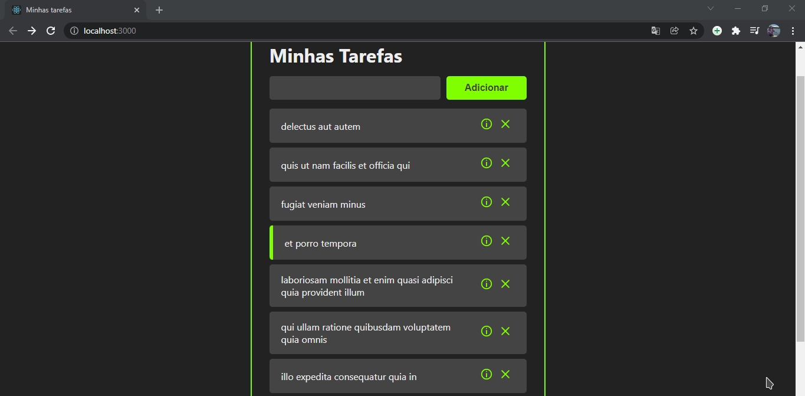

## [REACT.JS] GERENCIADOR DE TAREFAS</h2>

[PT-BR]💻 Gerenciador de tarefas utilizando componentes funcionais(a partir de funções), routers e API
<h3>🚀 Tecnologias utilizadas </h3>
<ul>
  <li> React.js </li>
</ul>

[ ENG ]💻 Task manager using components (from roles), routers and API

<h3>🚀 Technologies used </h3>
<ul>
  <li> React.js </li>
</ul>

👨‍💻 Preview: 

